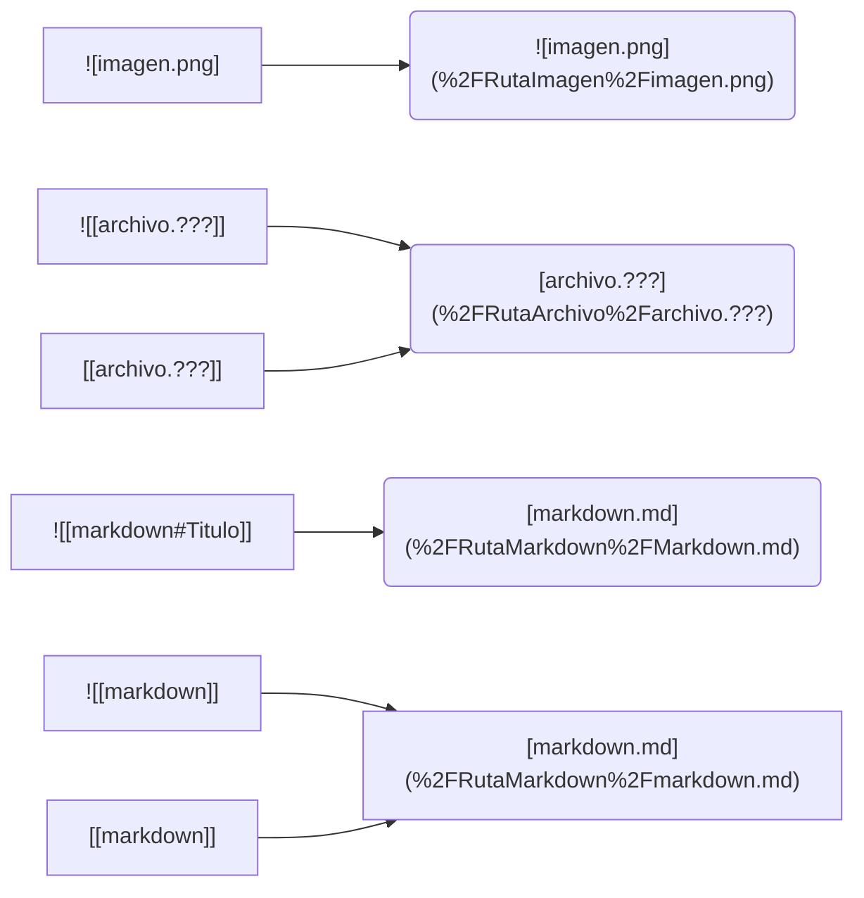

# Wikilinks to Markdown Links

## Uso

1. Ejecutar el scipt [check-duplicate-files.sh](check-duplicate-files.sh) para verificar que no hay archivos con el mismo nombre
```sh
./check-duplicate-files.sh <direcotrioRaizObsidian> <directorioRaizObsidian>
```

2. Ejecutar el script [wikilinks-to-markdownLinks.sh](wikilinks-to-markdownLinks.sh) para transformar los Wikilinks en Markdown Links
```sh
./wikilinks-to-markdownLinks.sh <direcotrioRaizObsidian>
```

## Requisitos

>- Ejecutarlo script al mismo nivel de la raíz de los archivos obsidian, es decir, que el script y la carpeta de obsidian estén juntos.
>- El nombre de los archivos no pueden tener nombres con espacios
>- Los nombres de los archivos deben de ser único. (Utilizar [check-duplicate-files.sh](check-duplicate-files.sh))
>- Solo puede haber links a archivos que estén en el mismo nivel o más abajo
>- Las imagenes solo pueden tener extensiones: jpg, png, gif, bmp, svg
>- No podrá convertir las imágenes que tengan un link: \[!\[Imagen\]\(./media/imagen\)\]\(URL\)

## Explicacion transformaciones
El script realiza las tranformaciones mostradas a continuación:

